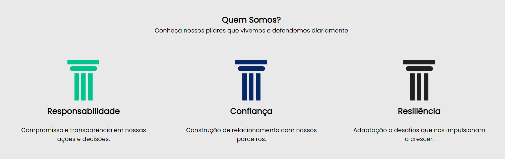
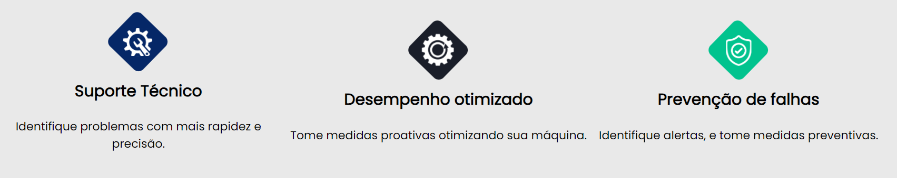

# Spectra
  Este projeto tem como objetivo o monitoramento em tempo real de servidores utilizados por empresas e consultorias especializadas em integração de dados. Esses servidores são utilizados por analistas, visando evitar atrasos nas respostas, redução de clientes e aumentar a disponibilidade 24/7. Além disso, busca promover a credibilidade e fornecer dados atualizados para embasar a tomada de decisões.

## Como funciona
  Atuamos no monitoramento de servidores como suporte para empresas e consultorias de integrações de dados que dependem do processamento em tempo real, sendo crucial para que o negócio não sofra danos que
poderiam ter sido evitados caso fossem monitorados, que possibilita atitudes preventivas e não apenas corretivas.

## Pilares que nos movem
  Nós da Spectra garantimos trabalhar com base em nossos 3 pilares:
Responsabilidade: Sempre buscamos trabalhar com você de maneira transparente
Confiança: Procuramos ter uma relação de confiança com você, onde queremos manter uma boa comunicação e respeito entre ambos
Resiliência: Sempre estamos nos desafiando ao crescimento e com isso a adaptação e resiliência são pontos crucias dentro da Spectra

Além de garantirmos um serviço que contenha:

## Conheça nosso time
Somos uma equipe de estudantes do 2 semestre do curso de Ánalise e Desenvolvimento de Sistemas na faculdade SPtech. Atualmente estágiarios da Atos Br, Bradesco e Stefanini.

## Ferramentas utilizadas

          
          
